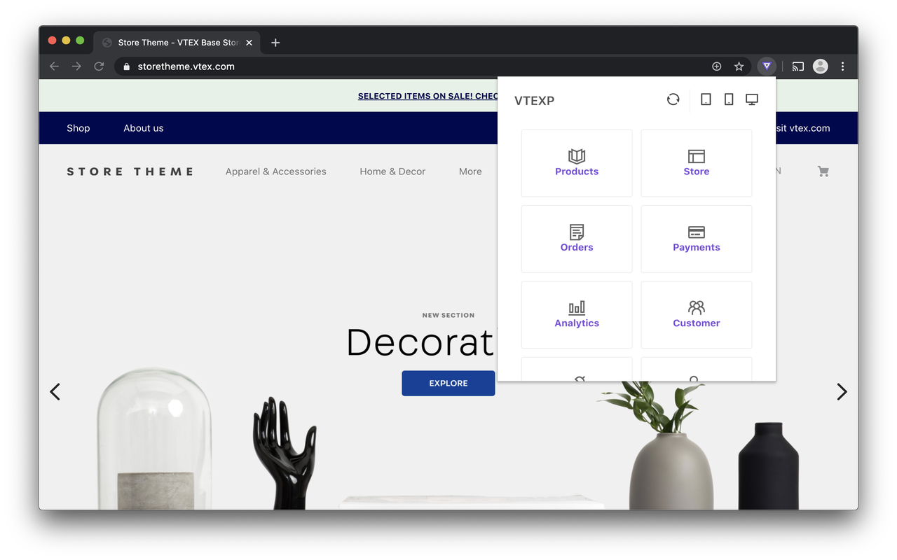

  

  <h1>VTEXP</h1>
  
  
A Browser extension for a better <b>VTEX EXP</b>erience.

  <!-- Stability -->
  
  <!-- NPM version -->
  
  <!-- Build Status -->
  
  <!-- Downloads -->
  
  <!-- License -->
  

## Features

- 🌈 Intuitive and beautiful
- ⏱ Don't waste time
- ~~📁 History of changes~~ `WIP`
- ~~🕶 Customizable~~ `WIP`
- ~~❌ No Adobe Flash Player~~ `WIP`
- ~~🛰  Edit and collaborate in real time~~ `WIP`

## Supported Browsers

- Chrome

## What is VTEXP?

VTEXP is an Open-Source and free extension that provides easy navigation and improves some features of the VTEX platform. With him you can use the shortcut menus to navigate the platform's administrative panel, and also change default parameters used for debugging the store's website.
More features coming soon

## Contribution

Comming soon

## License

MIT © [ganobrega](https://github.com/ganobrega)
